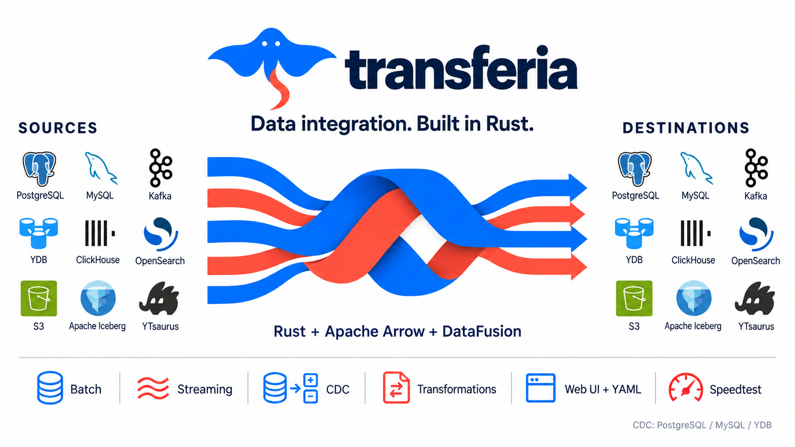

# Transferia

> [!WARNING]
> ### EXPERIMENTAL PROJECT. BACKWARD COMPATIBILITY IS NOT GUARANTEED.
>
> Configuration, APIs, and persisted state formats may change between revisions.

**Move data between databases, streams, and object storage.**

Transferia is a data integration engine written in Rust, with Apache Arrow batches
and DataFusion SQL transformations. Run batch transfers, consume streams, or
replicate database changes from the web UI or a YAML configuration.

[Quick start](#quick-start) · [Connectors](#connectors) · [Documentation](#documentation)

## Features

- **Batch, streaming, and CDC.** Copy existing data, follow changes, or start with
  a snapshot and continue with replication where the source supports it.
- **Arrow throughout the pipeline.** Process columnar batches with bounded memory
  and backpressure.
- **Transformations.** Filter records, rename tables, and apply SQL with
  Apache DataFusion.
- **Web UI and YAML.** Configure connections, inspect schemas, validate deliveries,
  manage workers, and export runnable configuration.
- **Built-in speedtest.** Measure source and destination throughput and tune
  connector settings where isolated benchmarking is supported.

## Quick start

Build prerequisites:

- Rust via rustup; the repository pins the toolchain in
  [rust-toolchain.toml](rust-toolchain.toml).
- Node.js 22 and npm for the embedded web UI.
- A C/C++ build toolchain, CMake, the Protobuf compiler (`protoc`), and `sccache`
  on `PATH`.

```bash
git clone https://github.com/timmyb32r/transferia.git
cd transferia
cargo build -p transferia-composition --bin transferia
./target/debug/transferia --server
```

Cargo installs frontend dependencies with `npm ci` and embeds the built UI in
the binary. Open [localhost:8080](http://localhost:8080), create a delivery,
choose its source and destination, then validate and activate it.

The server listens on loopback by default and stores its state in
`.transferia-server/`. For a first local experiment, use **Data generator (for
benchmarks)** and **Discard (for benchmarks)**; no external service is needed.

To run a delivery without the UI, save its exported YAML as `delivery.yaml`:

```bash
./target/debug/transferia --config delivery.yaml
```

## Connectors

| System | Source modes | Destination |
| --- | --- | --- |
| PostgreSQL, MySQL 8, YDB | Batch, CDC, snapshot followed by CDC | Yes |
| Kafka, Logbroker | Streaming | Yes |
| ClickHouse, OpenSearch | Batch | Yes |
| S3, Apache Iceberg, YTsaurus | Batch | Yes |
| Generator | Batch, streaming | — |
| Discard | — | Benchmark only; data is not stored |

Supported types, replication prerequisites, and delivery guarantees depend on
both connectors and the configuration. Transferia validates compatibility before
starting workers and rejects unsupported conversions or schema drift rather than
silently changing data. Exactly-once delivery is specific to the selected path;
it is not a guarantee for every connector pair.

## Documentation

- [Delivery lifecycle](docs/server.md#delivery-lifecycle)
- [Table selection](docs/table-selection.md)
- [Performance settings](docs/performance-options.md) and [benchmarking](docs/benchmarks.md)
- [Validation boundaries](docs/validation-boundaries.md)
- [Workspace architecture](docs/architecture.md)

For development, `just check-affected` runs the compile checks selected for your
changes. The [justfile](justfile) lists the available commands.
