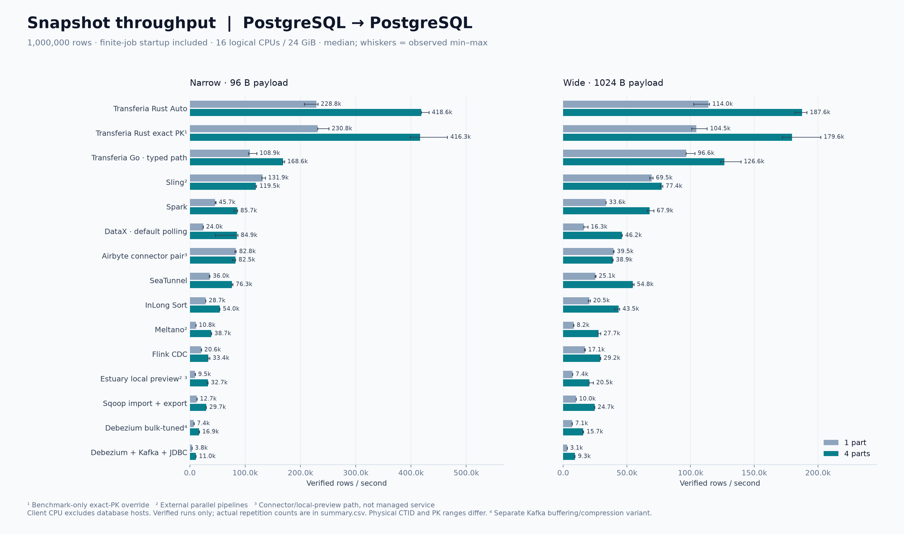
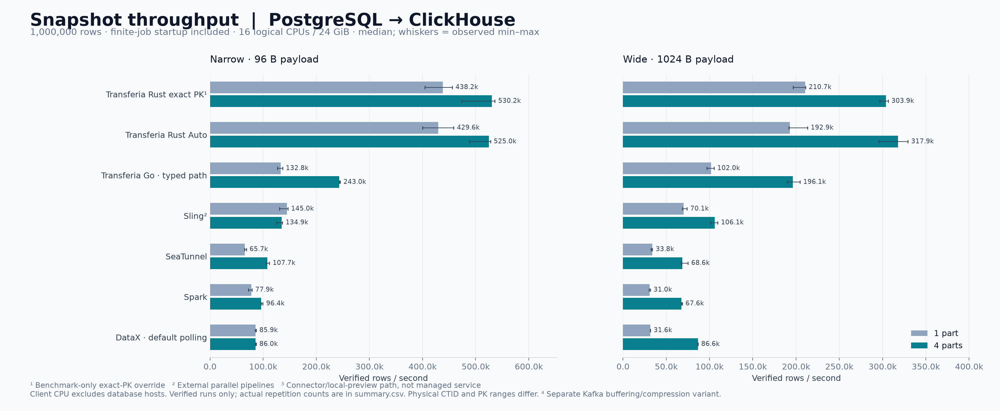
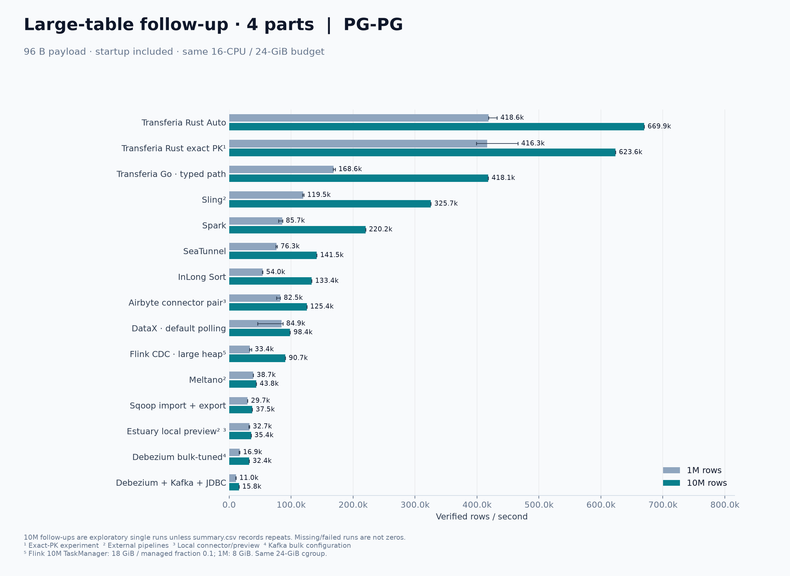
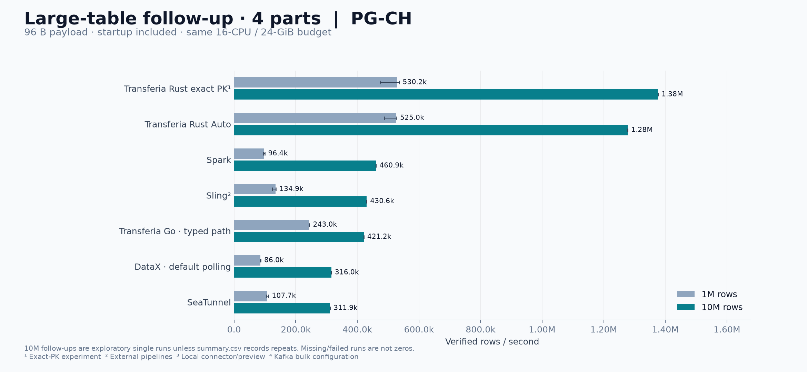
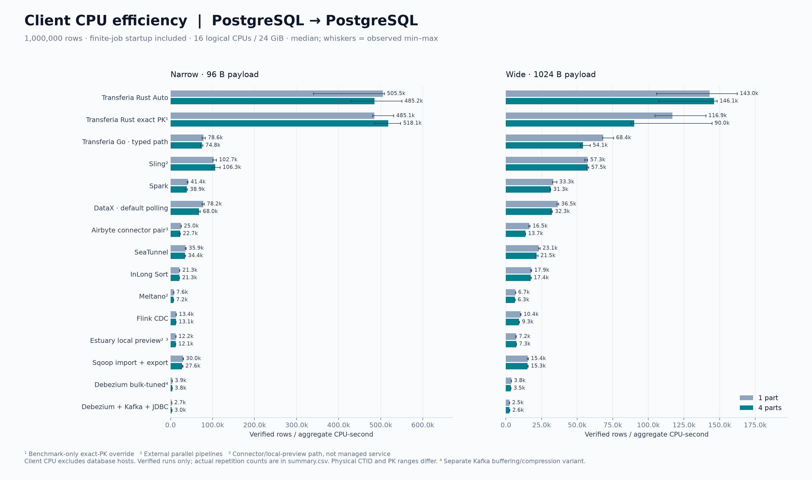
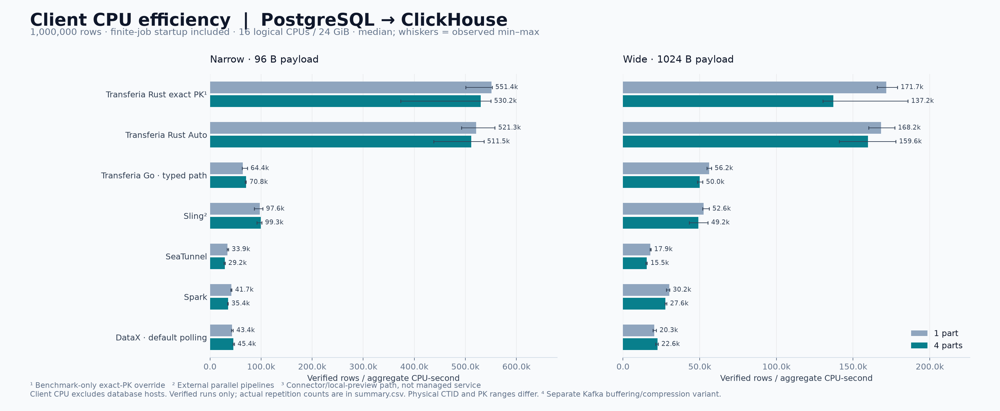
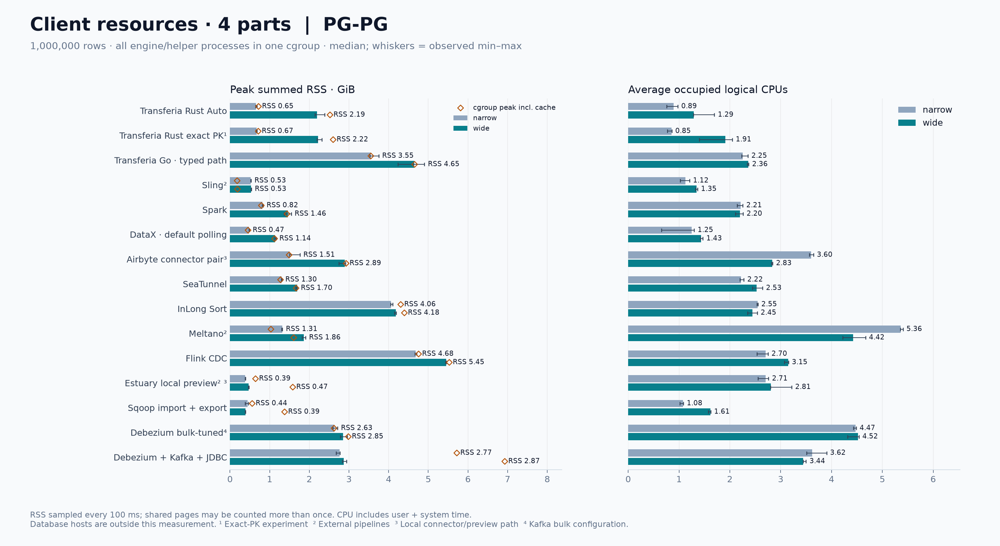
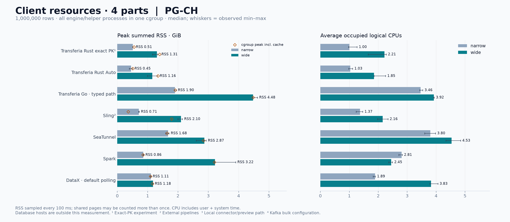
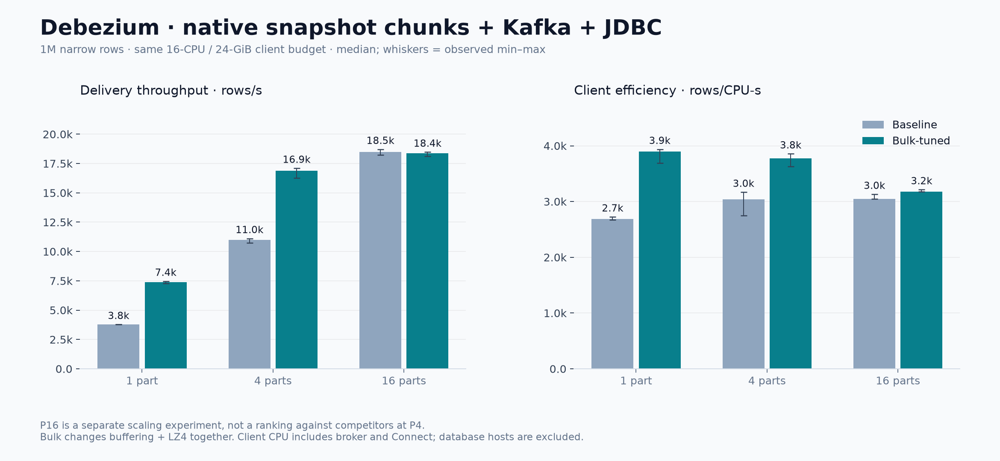
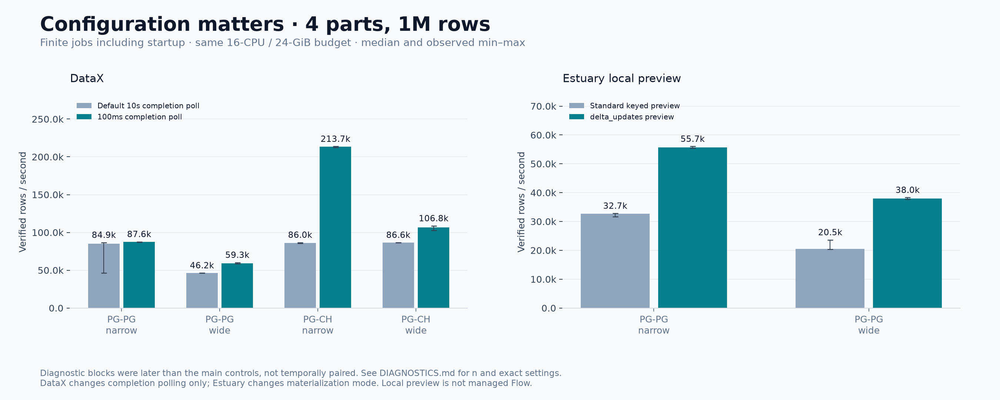

# Snapshot-бенчмарк: Transferia и 12 альтернатив

**Завершено в пределах семичасового бюджета: 264 основных прогона, 6 проверок Debezium P16, 24 больших прогона и 55 диагностик настроек. Все 349 принятых результатов прошли проверку данных.**

Сравниваем законченную доставку одной неизменяемой таблицы PostgreSQL в PostgreSQL и ClickHouse. У каждого участника одинаковый клиентский бюджет: 16 логических CPU, 24 GiB RAM, один и тот же сервер, TLS и общие базы. Основные режимы — одна часть и четыре части одной таблицы. Transferia Rust работает в release.

[Подробные таблицы](TABLES.md) · [Покрытие матрицы](COVERAGE.md) · [CSV](summary.csv) · [Протокол](PROTOCOL.md) · [Механизмы и исходники](MECHANISMS.md) · [Диагностика настроек](DIAGNOSTICS.md) · [Код стенда](../../../benchmarks/fair_snapshot/README.md)

## Итоги основной серии: 1 млн строк

У всех 88 основных сочетаний — три успешных повтора. В основных конфигурациях Transferia Rust Auto показала наибольший throughput среди 13 продуктов в PG→PG и шести в PG→CH на обоих профилях. Это результат данного стенда и конечных заданий, а не универсальный рейтинг.

| Приёмник | Payload | Rust Auto, строк/с | Rust, строк/CPU-с | Rust, peak RSS GiB | Go typed, строк/с |
|---|---:|---:|---:|---:|---:|
| PostgreSQL | 96 B | 418 601 | 485 244 | 0.65 | 168 555 |
| PostgreSQL | 1024 B | 187 639 | 146 110 | 2.19 | 126 551 |
| ClickHouse | 96 B | 525 028 | 511 454 | 0.45 | 242 988 |
| ClickHouse | 1024 B | 317 945 | 159 614 | 1.16 | 196 125 |

Все числа в этой таблице — **четыре части**, медианы трёх повторов. Полный список участников, P1, CPU и память — в [TABLES.md](TABLES.md).

Главные практические выводы основной серии:
- **Известные настройки конкурентов существенно меняют результат.** Go homogeneous PG→PG достиг 191,7/139,3 тыс. строк/с на узких/широких данных против 168,6/126,6 тыс. в основном typed-пути. DataX→CH с коротким completion poll достиг 213,7/106,8 тыс. вместо 86,0/86,6 тыс. Эти дополнительные блоки не были временно спарены с основной серией; их нельзя скрывать за рейтингом defaults.
- **Четыре части не дают автоматически 4×.** Rust Auto получил 1,83×/1,65× в PG и 1,22×/1,65× в CH. Airbyte connector pair остался около 1×; Sling на узкой таблице даже немного замедлился. Эти наблюдения относятся ко всей цепочке, включая startup и sink, и не доказывают, что splitter сам по себе плох.
- **Преимущество Rust здесь не сводится к CTID.** Принудительный exact-PK вариант имеет throughput в пределах примерно 5% от Auto на четырёх основных P4-профилях. Это контролирует выбор границ в данном fixture, но не изолирует все различия reader/runtime.
- **Debezium действительно переносит одну таблицу параллельно.** Baseline на узкой таблице: 3,8 → 11,0 → 18,5 тыс. строк/с при P1/P4/P16. Bulk-пакет даёт 7,4 → 16,9 → 18,4 тыс.; на P16 выигрыша по wall time уже не видно. Сравнение других участников остаётся P1/P4.
- **Скорость и CPU-эффективность — разные цели.** DataX batch8192 ускоряет узкое PG-задание с 87,6 до 122,0 тыс. строк/с, но снижает строки/CPU-с с 68,6 до 59,9 тыс. Нельзя выбирать конфигурацию только по одной из этих метрик.

## Что именно измерено

В PostgreSQL сравниваются 13 продуктов: Transferia Rust, Transferia Go, SeaTunnel, Sling, DataX, Airbyte, Flink CDC, Debezium, InLong, Meltano, Spark, Sqoop и Estuary. Rust с принудительными точными PK-диапазонами и Debezium с bulk-настройками — дополнительные варианты, не отдельные продукты.

Для ClickHouse подготовлены адаптеры шести продуктов: Transferia Rust/Go, SeaTunnel, Sling, DataX и Spark. Отсутствие остальных на этом графике означает отсутствие измерения в данной кампании, а не отсутствие поддержки ClickHouse у продукта.

Основной набор — 1 млн узких строк с payload 96 байт и 1 млн широких с payload 1024 байта. Дополнительный — 10 млн узких строк. Пять полей: BIGSERIAL PK, два BIGINT, два TEXT; все NOT NULL. Ключи равномерные, физическая загрузка в порядке ключа, текст хорошо сжимается. Это не тест случайных бинарных данных, составных ключей, NULL, сложных типов или перекоса распределения.

Все принятые результаты проверяют **каждое значение каждой строки**, число строк, уникальность и границы ключей. Успешного exit code недостаточно. Отдельный [аудит фактических схем](destination-schema-audit.json) проверяет сохранение PK/NOT NULL в PostgreSQL и engine/order/types в ClickHouse. Неудачные и заменённые прогоны сохранены в [таблицах](TABLES.md), но исключены из рейтингов.

## Стенд

Клиентский сервер: AMD EPYC 7713, KVM, 32 доступных логических CPU, около 47 GiB RAM, swap отсутствует. Каждому участнику выделены CPU 0–15 и 24 GiB; пять существовавших контейнеров на время измерений перенесены на CPU 16–31. Это изоляция affinity, а не выделенный физический хост.

Все три управляемые БД используют preset `s4-c32-m128` и по 2000 GiB local SSD на хост; [снимок ресурсов из yc](cluster-resources.json). PostgreSQL 17.11, ClickHouse 26.3.33.24. Оба PostgreSQL работают с SESSION pooling, `synchronous_commit=on`, `jit=off`; параметры сохранены в [provenance.json](provenance.json). Синхронность записи PostgreSQL не отключалась ради скорости.

## Производительность

Время начинается перед запуском контейнера и включает старт JVM/движка, планирование, соединения, чтение, запись и завершение. Создание исходных данных, подготовка таблицы назначения и итоговая проверка находятся вне таймера. Поэтому это скорость **конечного задания**, а не установившегося потока уже прогретого кластера. У тяжёлых runtime малые таблицы сильнее зависят от старта; отдельный 10M-прогон показывает, насколько меняется картина на более длинном задании.

Каждый столбик — медиана принятых повторений; усики — минимум и максимум, не доверительный интервал. Точное `n` видно в таблицах. Части сравниваются внутри общего бюджета: P4 не получает вчетверо больше CPU или памяти.

## Большая таблица: 10 млн строк

**Все 22 сочетания P4 завершены и проверены.** В дополнительных больших P1-прогонах успешно завершились Spark→PG (70,2 тыс. строк/с) и SeaTunnel→CH (116,6 тыс. строк/с). Sqoop→PG и Debezium bulk→PG превысили лимит 600 секунд; throughput им не присваивается. Ещё 18 P1-сочетаний не запускались до временной отсечки — это явно отражено в [COVERAGE.md](COVERAGE.md). Это одиночные exploratory-прогоны, их нельзя смешивать с тройными повторами на 1 млн строк. Payload остаётся 96 B, бюджет — 16 CPU / 24 GiB.

Rust Auto: **669,9 тыс. строк/с в PostgreSQL** и **1,278 млн строк/с в ClickHouse**. В PG его показатели — 485,1 тыс. строк/CPU-с и 1,99 GiB peak RSS; в CH — 535,3 тыс. строк/CPU-с и 1,34 GiB. Go typed: 418,1 тыс. строк/с в PG, 98,5 тыс. строк/CPU-с и 9,45 GiB peak RSS. Разрыв по throughput PG сократился с 2,48× на миллионе до 1,60× на 10 млн. Больший fixture изменяет выводы, поэтому рейтинг малого задания нельзя механически переносить на долгую загрузку.

В ClickHouse на 10 млн строк Spark достиг 460,9 тыс. строк/с, Sling — 430,6 тыс., Go typed — 421,2 тыс., DataX — 316,0 тыс., SeaTunnel — 311,9 тыс. Разница между близкими одиночными результатами ещё не доказывает устойчивый порядок мест. Rust Auto в этом прогоне быстрее Spark примерно в 2,77×. CPU-эффективность Spark здесь 214,4 тыс. строк/CPU-с против 535,3 тыс. у Rust: разрыв около 2,50×, тогда как на 1M он составлял около 14,4×. Короткий тест особенно чувствителен к фиксированным CPU-затратам runtime.

На большом fixture exact-PK вариант Rust дал 623,6 тыс. строк/с в PG и 1,376 млн в CH: Auto быстрее него примерно на 7,4% в PG, а exact-PK быстрее Auto на 7,7% в CH. По одному прогону нельзя объявить победивший splitter: направление меняется между приёмниками, а статистической устойчивости здесь не проверяли.

Рост скорости на больших заданиях согласуется с амортизацией запуска, JIT и заполнением конвейера, но эти причины не разделены отдельным экспериментом. Например, Spark→CH вырос примерно в 4,78× относительно 1M, Go→PG — в 2,48×, Rust Auto→PG — в 1,60×. Это сравнение двух полных заданий, а не напрямую измеренный steady-state throughput.

## CPU и память

`rows/CPU-second = проверенные строки / суммарное user+system CPU time`. Это ответ на вопрос об эффективности использования ядра. Он **не является отдельно измеренной скоростью при ограничении процесса одним ядром**: в таком режиме могут измениться очереди, GC и перекрытие I/O. Среднее число занятых логических CPU равно CPU time / wall time; например, 250% означает в среднем 2,5 CPU. Для другой нормализации — на выделенный бюджет — throughput делится на 16. CSV содержит и `rows_per_cpu_second`, и `rows_per_allocated_cpu_second`.

CPU включает весь контейнер участника: source/sink, дочерние процессы, Kafka/Connect для Debezium, Flink runtime, локальные protocol adapters. Управляющий Python-контроллер не переносит пользовательские строки. Его CPU, наблюдатель и общий Docker daemon находятся вне client cgroup; подготовка и проверка данных также не входят в ресурсный счёт участника. Spark Python строит JVM-план; Python у Meltano является собственным runtime конкурента.

RSS — максимум суммы памяти процессов, опрос каждые 100 мс; shared pages могут учитываться повторно. Ромбы на графике — cgroup peak, включая файловый кеш. Kafka logs и промежуточные файлы поэтому влияют на cgroup memory. **CPU/RAM управляемых PostgreSQL и ClickHouse не входят в эти показатели.** Нельзя выводить из них полную стоимость распределённой системы.

## Насколько одинаковы четыре части

Число частей выровнено, но механизмы сознательно не заменены одной искусственной реализацией:

| Механизм | Участники в этом опыте | Следствие |
|---|---|---|
| Физические CTID-диапазоны | Rust Auto, Airbyte | Позволяют читать диапазоны heap без обхода PK-индекса; размеры частей по строкам могут различаться. |
| Явные четверти числового PK | Rust exact PK, Spark, DataX; внешние Sling/Meltano/Estuary | Границы известны из fixture; это преимущество перед планировщиками, которые вычисляют их во время задания. |
| Native JDBC numeric ranges | SeaTunnel, InLong, Sqoop | Собственный splitter/runtime, числовые границы заданы. Sqoop включает отдельный import и export. |
| Sequence-key quantiles | Transferia Go | Получение границ через percentile_disc имеет собственную стоимость; BIGSERIAL важен для выбора этого пути. |
| Snapshot chunks с координацией | Flink CDC | Дополнительная работа snapshot/watermark/checkpoint, хотя дальнейший CDC здесь не измеряется. |
| COUNT + PK OFFSET boundaries | Debezium P4/P16 | Дополнительное чтение для планирования; больше частей не даёт бесплатного линейного ускорения. |

Конфиги и собственные логи движков подтверждают разбиение. Выборка `pg_stat_activity` раз в 500 мс — дополнительное наблюдение, которое может пропустить короткие SELECT/FETCH/COPY. Значение `max_active=0/1` само по себе не опровергает четыре части.

Rust exact PK — **отдельный экспериментальный бинарник**, а не скрытая настройка Auto. Он сохраняет production reader/writer и стоимость discovery/planning, но заменяет выбор стратегии и границы на известные четверти fixture. Код патча сохранён; рабочий исходник проекта не менялся.

## Почему движки выполняют разную работу

Полная таблица по каждому продукту находится в [MECHANISMS.md](MECHANISMS.md). Важные различия для интерпретации:

- **Протокол данных.** Rust использует PostgreSQL binary COPY с Arrow внутри; Go — собственный binary pipeline и pgx CopyFrom; Sling использует COPY в назначении. JDBC, Singer JSON и Kafka JSON envelopes дают другую стоимость преобразования и сериализации. Наблюдаемый разрыв нельзя целиком приписать языку реализации.
- **Запись и транзакции.** `batch=1000` не означает одинаковые commit boundaries. DataX делает commit после batch; Spark — после partition/task. Rust/Go COPY и ClickHouse native blocks — иной путь. У Meltano/Flink/Estuary есть keyed/upsert/materialization-работа, не требуемая простому INSERT в пустую таблицу.
- **Версия JDBC.** Даже при batch=1000 старый pgJDBC DataX разбивает его на 10 INSERT, а используемый Spark 42.7.13 — на 6. Это подтверждается кодом и числом SQL calls; меньше вызовов не означает пропорционально меньший wall time.
- **Staging.** Sling создаёт временную таблицу и переносит в конечную. Sqoop сначала пишет файлы, затем экспортирует. Estuary local preview материализует сохранённый JSONL. Эти фазы включены во время и ресурсы.
- **Брокер и сериализация.** Debezium здесь означает полный PostgreSQL→Kafka→JDBC путь, включая broker и Connect. Это нельзя сравнивать со скоростью одного source connector, забыв доставку в конечную таблицу. Bulk-вариант меняет пакет настроек compression/buffering; это A/B пакета, не изолированный тест LZ4.
- **Количество соединений.** У Debezium JDBC sink default minimum pool=5 на task. P16 требует 80 pooled connections. Для него поднят лимит user1 с 50 до 200, затем все принятые P16 повторения сделаны заново. Пулы потребляют также память backend PostgreSQL за пределами client RSS.
- **Байты и строки.** Go→CH имеет разные byte/row thresholds; DataX→CH ограничивает batch не только 65536 строками, но и 32 MiB. Поэтому одинаковое nominal batch size не гарантирует одинаковые INSERT.
- **Части и одновременные readers.** Для буферизующего Flink CDC размер целого chunk влияет на heap; у потокового COPY другой профиль памяти. Много небольших частей при четырёх readers — отдельная конфигурация, которая могла бы изменить результат, но не подменяла общий тест четырёх частей.

Это объяснения по коду и наблюдаемой конфигурации. Точное количество процентов, вызванное каждым фактором, потребовало бы отдельного контролируемого эксперимента. Основная серия не является обещанием максимально настроенной производительности каждого продукта: проверенные улучшения DataX, Go и Estuary приведены отдельно и должны учитываться вместе с основным рейтингом.

Для Flink CDC большой набор потребовал отдельной настройки памяти: исходный TaskManager 8 GiB получил Java heap OOM; проверенный повтор использует 18 GiB и managed fraction 0.1 при прежнем общем cgroup 24 GiB. Это помечено на большом графике и в CSV; [разбор буфера целой части](MECHANISMS.md#flink-cdc-большой-chunk--большой-heap) и [исходная ошибка](flink-large-failure.json).

## Дополнительные проверки настроек

[DIAGNOSTICS.md](DIAGNOSTICS.md) отдельно показывает DataX/Spark с pgJDBC prepareThreshold 0/5, Estuary local preview с delta_updates, DataX с коротким completion polling и homogeneous PG→PG режим Transferia Go (`NoHomo=false`). Основной Go-ряд использует общий typed-путь (`NoHomo=true`). Также отдельно проверен JDBC writer batch 8192 против 1000; для Flink выполнен один 10M/P4 диагностический запуск с backfill-skip на неизменяемом источнике и тем же увеличенным heap. Он дал 108,1 тыс. против 90,7 тыс. строк/с, 66,2 тыс. против 23,5 тыс. строк/CPU-с и 11,6 против 16,9 GiB peak RSS. Эти одиночные результаты не доказывают универсальный выигрыш; гарантии при изменении источника отличаются. Эти прогоны не смешиваются с основными медианами. У DataX default scheduler проверяет завершение раз в 10 секунд: это может сильно менять скорость короткого конечного задания при почти одинаковом CPU time. Графики явно помечают основной DataX как default polling.

## Границы применимости

Airbyte измерен как пара официальных connector binaries с небольшим release Rust bridge для platform-level checkpoint counting; bridge разбирает JSON для учёта, пересылает записи без изменения байтов и входит в CPU/RAM/time; Estuary — как официальные batch capture/materialize через local preview. **Полные Airbyte platform и managed Estuary Flow не измерялись.** InLong представлен standalone Sort, не Manager/Agent. Результаты локальных путей нельзя выдавать за предел производительности этих платформ.

Источник неизменяемый. Независимые внешние reader-процессы получают эквивалентные данные здесь, но это не доказательство общего MVCC snapshot при concurrent writes. Проверка конечного состояния также не обнаружит повторную запись того же значения, если upsert скрыл её. Тест не измеряет crash recovery, CDC latency или exactly-once после аварии. ClickHouse пишет на один хост в обычный MergeTree; replicated durability не сравнивается.

Источник помещается в кеш, кеш ОС не сбрасывался. Это warm-cache опыт. Порядок повторений рандомизирован, но autovacuum, ClickHouse merges, сеть и гипервизор не находятся под полным контролем. Оценки EXPLAIN в [query-plans.json](query-plans.json) — стоимость планировщика, не измеренное время и не CPU БД.

## Воспроизводимость

[Исходные результаты](runs.jsonl), [агрегаты](summary.json), [покрытие](coverage.json), [версии образов и окружение](provenance.json), [снимки исследованных исходников](source-references.json), [очищенные конфигурации](configurations.json), [наблюдаемые SQL-запросы](source-queries.json), [доказательства разбиения](partition-evidence.json), [размеры промежуточных файлов](intermediate-file-sizes.json). На сервере исходные логи и 100-мс samples лежат в `~/benchmark-20260921/results/`. Конфиги с паролями остаются в закрытом `private/`; в отчёт экспортируются только очищенные копии.

Rust собран из снимка `27b0f4e1629d32d7c969140a4c1cb081e9d8f83a`, rustc 1.96.0, release / fat LTO / target-cpu=native. Предоставленный Go binary сообщает go1.26.5; его точный Arcadia commit из build info не установлен.

Для повторного анализа используются `analyze.py`, `report_tables.py`, `coverage.py` из [стенда](../../../benchmarks/fair_snapshot/). Версии Matplotlib зафиксированы. Docker tags дополнены immutable image IDs/digests; публичный source commit Transferia Go не считается доказанно совпадающим с предоставленным Arcadia binary.

## Завершение и проверка

[Финальный аудит](final-audit.json) подтверждает одинаковый бюджет CPU/RAM и отсутствие пересечения измерений для всех 349 принятых запусков. Аудит схем охватил 241 таблицу PostgreSQL и 98 таблиц ClickHouse, включая диагностические прогоны: нарушений не найдено. Airbyte переиспользует таблицу каждого профиля, поэтому это проверка сохранённой схемы, а не исторический DDL-аудит каждого запуска.

[Уборка сервера](cleanup.json) завершена: измеряемых контейнеров не осталось, временные неактивные replication slots/publications удалены; существовавший managed replication slot сохранён. Пяти старым контейнерам возвращён доступ ко всем 32 CPU. Docker проигнорировал пустой cpuset, поэтому теперь явно записано `0-31` вместо исходного пустого значения; на текущем сервере доступ к CPU эквивалентен, но при будущем добавлении CPU этот список потребуется расширить.

Успешные временные Kafka/Sqoop/Flow-файлы удалены с сохранением [журнала](pruned-intermediates.jsonl) и размеров; staging неуспешных запусков оставлен. На серверном диске после уборки свободно 168 GiB. Исходные и итоговые таблицы, логи, замеры и бинарники сохранены. В тестовых PostgreSQL оставлены SESSION pooling, лимит user1=200, права репликации источника, `pg_stat_statements` и destination search_path `fair21,public`.

Изменения проекта ограничены стендом и документацией. `just check-affected` прошёл (0,99 с); синтаксис Python, JSON и локальные ссылки проверены. Полный release gate не запускался. Изменения не закоммичены.
