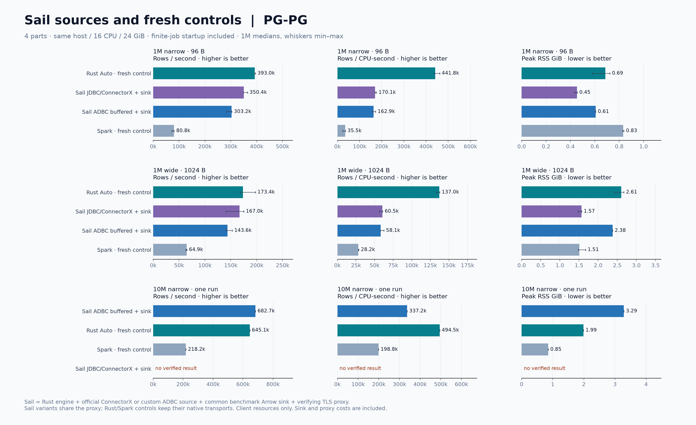
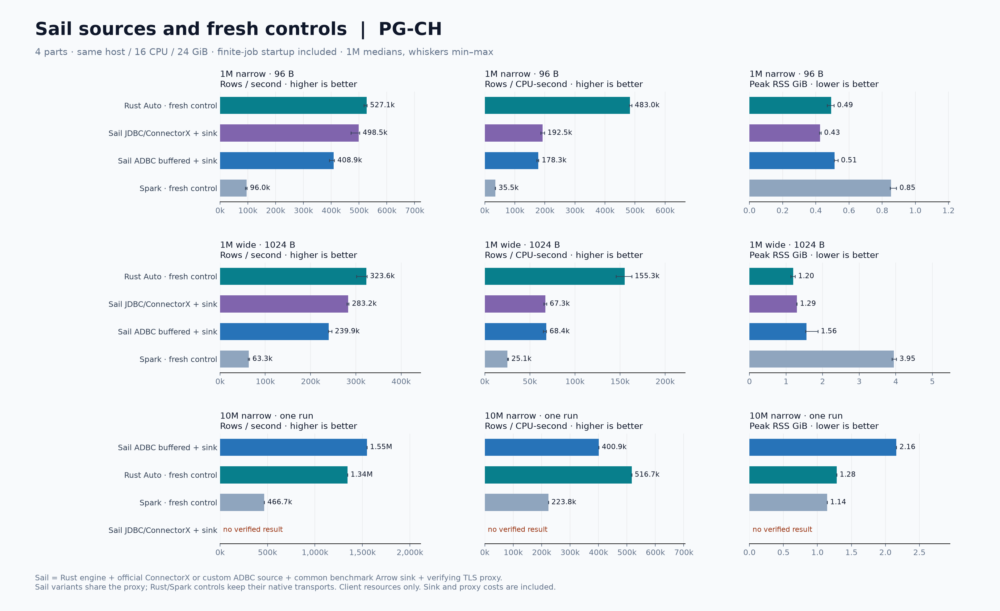

# Sail: JDBC/ConnectorX и ADBC

**Завершено 80 случаев: 78 с полной проверкой данных, два JDBC-таймаута на 10 млн строк. Все 72 основных запуска на 1 млн строк успешны.**

Добавление к исходному snapshot-бенчмарку по запросу пользователя. Используется Sail 0.7.1 — официальный Linux wheel с нативным Rust-движком, клиент Spark Connect 4.2.0. Вычисления и доставка выполняются только на сервере. Python управляет Arrow batches; пользовательские строки не преобразуются в Python-списки/словари.

## Основная серия: 1 млн строк, четыре части

Все значения — медианы трёх запусков; throughput в тысячах проверенных строк/с.
Контроли здесь свежие, выполненные вперемешку с Sail.

| Доставка / payload | Sail JDBC + sink | Sail ADBC buffered + sink | Transferia Rust Auto | Spark |
|---|---:|---:|---:|---:|
| PG → PG / 96 B | 350,4 | 303,2 | 393,0 | 80,8 |
| PG → PG / 1024 B | 167,0 | 143,6 | 173,4 | 64,9 |
| PG → CH / 96 B | 498,5 | 408,9 | 527,1 | 96,0 |
| PG → CH / 1024 B | 283,2 | 239,9 | 323,6 | 63,3 |

В этих четырёх случаях JDBC/ConnectorX быстрее ADBC buffered на **16–22%**.
Sail JDBC с нашим приёмником быстрее свежего Spark в **2,6–5,2 раза**,
но это сравнение разных полных путей доставки, включая COPY/Arrow против JDBC
на записи. Оно не выделяет эффект Rust вместо JVM. Rust Auto быстрее Sail JDBC
на **4–14%** и отдаёт в **2,3–2,6 раза** больше строк на CPU-секунду клиента.
В стоимость Sail включены общий Python/Arrow sink и двойной TLS-прокси;
отдельный вклад этих расходов не изолирован.

ADBC здесь не выигрывает: дополнительная консолидация целой части — существенное
отличие от потенциального streaming-пути. Эти цифры не доказывают, что протокол
ADBC в принципе медленнее ConnectorX.

## Большая таблица: 10 млн строк, четыре части

По одному запуску, payload 96 B. Это exploratory-результаты, не устойчивый рейтинг.

| Доставка | Sail JDBC + sink | Sail ADBC buffered + sink | Rust Auto, свежий | Spark, свежий |
|---|---:|---:|---:|---:|
| PG → PG, тыс. строк/с | таймаут 600 с | 682,7 | 645,1 | 218,2 |
| PG → CH, тыс. строк/с | таймаут 600 с | 1547,5 | 1342,7 | 466,7 |

В этих одиночных запусках ADBC buffered опередил Rust по wall-clock throughput
на 6% и 15%. Однако эффективность составила 337/401 тыс. строк/CPU-с против
495/517 тыс. у Rust; peak RSS — 3,29/2,16 GiB против 1,99/1,28 GiB
(порядок: PG/CH). То есть более быстрое завершение здесь требует больше
клиентского CPU и памяти. Повторов недостаточно, чтобы объявить устойчивое
преимущество. JDBC-таймауты не заменяются нулями и не участвуют в ранжировании.

## Что сравнивается

| Вариант | Чтение PostgreSQL | Запись |
|---|---|---|
| Sail JDBC + sink | Штатный `pysail.spark.datasource.jdbc`, ConnectorX 0.4.6. Это название API; JVM и Java JDBC-драйвера здесь нет. | Общий benchmark Arrow sink |
| Sail ADBC + sink | Пользовательский datasource через ADBC PostgreSQL 1.12.0, binary COPY → буфер целой части → Arrow | Тот же benchmark Arrow sink |
| Rust Auto, свежий контроль | Исходный release-бинарник и конфигурация основной серии | Штатный приёмник Transferia |
| Spark, свежий контроль | Исходный Spark 3.5.7 и JDBC-конфигурация основной серии | Штатный JDBC-приёмник Spark |

**Это Sail с явно добавленными адаптерами, а не штатный продукт для PostgreSQL→PostgreSQL/ClickHouse.** Проверка установленной версии возвращает `[jdbc::writer] ... writer is not implemented`. Поэтому нельзя выдать скорость одного чтения или результата `count()` за end-to-end доставку. Пользовательский источник ADBC и общий приёмник реализованы в [sail_adapters.py](../../../benchmarks/fair_snapshot/sail_adapters.py).

**В принятой серии ADBC используется buffered workaround**, а не streaming. Первый streaming P1/wide и попытка исправить ситуацию per-batch ingest завершились таймаутом 180 с. В Sail 0.7.1 `PythonDataSourceStream::run_python_reader` вызывает `tx.blocking_send` в `Python::attach`, удерживая GIL; при заполнении очереди Python writer не может её освободить. Зафиксированные source `ClientWrite` и sink `idle in transaction` согласуются с этой взаимной блокировкой. Изменение только sink не помогло. Обход предварительно читает всю часть через ADBC и делает `combine_chunks`, затем отдаёт ровно один batch; это добавляет память и копирование. Бинарник Sail не изменён.

На 10M/P4 штатный JDBC также завис в обоих маршрутах — PG и CH
(по одному прогону, каждый завершён таймаутом 600 с).
В ConnectorX 0.4.6 размер Arrow batch — 65536 строк: 250 тыс. строк/часть
дают около четырёх batches, а 2,5 млн — около 39. Это пересекает ёмкость
исходящей очереди Sail (16) и согласуется с тем же GIL/backpressure-механизмом.
Это объяснение по исходникам и наблюдаемому простою, а не снятый native stack
зависшего процесса. Неудачный прогон не получает значения throughput.

В PostgreSQL приёмник использует нативный ADBC ingest/COPY из `RecordBatchReader`, затем `commit` на каждую часть. В ClickHouse — `clickhouse-connect` с Arrow по HTTPS, синхронные INSERT, LZ4, не более 65536 строк на запрос. Весь adapter/runtime/proxy входит в один измеряемый cgroup. ADBC PostgreSQL — нативный C/C++-драйвер через Python bindings; эта комбинация не является полностью Rust-стеком.

## Условия

Те же неизменяемые таблицы: 1 млн строк с payload 96/1024 B и 10 млн с payload 96 B, пять полей, BIGSERIAL PK, без NULL. Одна или четыре непересекающиеся части, общий бюджет 16 CPU / 24 GiB. У Sail JDBC числовой splitter штатный; у ADBC — те же четверти PK. Крайние открытые границы штатного JDBC не меняют набор строк этого fixture.

Перед блоком прежние klg-хосты двух управляемых PostgreSQL оказались replicas. Primary возвращены на первоначальные klg-хосты; после этого подтверждены `pg_is_in_recovery=false`, `synchronous_commit=on`, `jit=off`, те же версии и данные. Payload прочитан для warm-cache подготовки вне таймера. Из-за перерыва и смены ролей вместе с Sail рандомизированы свежие P4-контроли Rust/Spark; старые медианы не дополняются этими повторами.
Свежие P4-медианы Rust/Spark отличаются от исторических на −7,6…+1,8%.
Поэтому численные отношения в этом разделе рассчитаны относительно свежих
контролей; общие графики сохраняют исторические медианы и отмечают Sail как
поздний блок. Статистическая значимость этого дрейфа не оценивалась.

Выполнено: Sail — 48 основных запусков (два источника × два приёмника × два профиля × P1/P4 × три повтора), четыре одиночных 10M/P4. Контроли — 24 основных P4 и четыре 10M/P4. Всего 80 исходов: 50 успешных Sail, 28 успешных контролей, два неуспешных Sail JDBC 10M. Время включает startup Sail/Python/TLS-прокси, schema discovery, чтение, запись, commit и завершение. Подготовка и полная проверка пяти значений каждой строки — вне таймера.

## TLS: одинаковый прокси для двух вариантов

В установленном ConnectorX `sslmode=verify-full` не принимается. В исходниках точного release tag ConnectorX 0.4.6 `sslmode=require` с CA проверяет цепочку, но отключает проверку имени хоста. По согласованию с пользователем оба источника Sail используют одинаковый stunnel 5.72, проверяющий удалённые CA и hostname. ADBC-приёмник PG и HTTPS-приёмник CH подключаются напрямую с полной TLS-проверкой.

У источника есть также TLS на loopback-участке. Он нужен потому, что libpq отвергает SCRAM-SHA-256-PLUS advertisement через plaintext-прокси. Локальный сертификат создаётся заранее, приватный ключ хранится только на сервере. Channel binding явно отключён у обоих источников: TLS завершается в прокси, и локальный/удалённый сертификаты различаются. Проверка удалённого сертификата и имени при этом остаётся включена. Проба с неправильным `checkHost` завершилась ошибкой certificate verification.

Расходы двух TLS-участков и локального прокси включены в Sail CPU/RAM/time. У Rust/Spark остаётся прямой штатный TLS-путь: их сравнение с Sail показывает стоимость всей этой конкретной комбинации. A/B JDBC против ADBC использует одинаковый прокси и приёмник. Это не сравнение изолированной скорости Rust-движков.

## Механизмы, влияющие на результат

- **Буферизация источника.** В установленном JDBC datasource `cx.read_sql(..., return_type='arrow')` сначала создаёт целую Arrow Table части, затем `table.to_batches()` передаёт её Sail. Первоначальный ADBC stream использовал подсказку 8 MiB, но завис при обратном давлении. В принятой buffered-конфигурации ADBC читает всю часть и консолидирует chunks; подсказка 8 MiB относится только к промежуточным batches и не ограничивает итоговую память. У JDBC передан fetchsize=8192 для сопоставимости API, но его reader не использует эту опцию как streaming-лимит.
- **Декодирование.** ConnectorX и ADBC выполняют нативное декодирование PostgreSQL в Arrow; пользовательский код оперирует batches, не Python-значениями каждой строки. Стандартный Spark JDBC использует JVM и другой формат внутренних строк. Исходный Sail JDBC reader побайтно проверен против release tag; его реализация не была заменена собственным reader.
- **Запись.** ADBC COPY, Arrow HTTPS и Spark JDBC имеют разные сериализацию и границы commit. Пустая таблица и конечные значения совпадают; транзакционная атомарность всех частей и восстановление после сбоя не доказывались.
- **Планирование и старт.** Миллион строк чувствителен к фиксированной цене запуска. Большие результаты одиночные и не являются измерением чистого steady-state.

## Завершение

Финальный аудит подтвердил 80 уникальных случаев, отсутствие пересечения
измерений, одинаковый бюджет 16 CPU / 24 GiB, корректную арифметику метрик,
точные числа commit частей и 78 проверенных схем приёмников — 39 PG и 39 CH.
Пять фоновых контейнеров вернулись к исходному для этого блока CPU affinity
`0-31`; измеряемых контейнеров не осталось. На серверном диске свободно 159 GiB.
Исходные данные, результирующие таблицы, логи и 100-мс samples сохранены.

В общие графики добавлены только 50 успешных Sail-прогонов; свежие Rust/Spark
контроли остаются отдельным набором. Исторический `runs.jsonl` не изменён.
Предварительные попытки и таймауты сохранены, но не подмешиваются в медианы.

## Артефакты

- [Все 80 исходов](sail-followup.json), [агрегаты CSV](sail-summary.csv), [подробные таблицы P1/P4, CPU и RAM](SAIL-TABLES.md).
- [Очищенные конфигурации](sail-configurations.json), [версии и образ](sail-environment.json), [SQL и подтверждения commit частей](sail-partition-evidence.json).
- [Финальный аудит](sail-final-audit.json), [схемы приёмников](sail-schema-audit.json), [отрицательная TLS-проба](sail-tls-evidence.json), [восстановление CPU affinity](sail-affinity.json).
- Диагностика: [первая streaming-попытка](sail-first-attempt.json), [per-batch ingest](sail-batch-ingest-attempt.json), [отсутствующий штатный writer](sail-native-probe.json), [простой большого JDBC-прогона](sail-stall-evidence.json). Эти попытки не добавляются к принятым повторам.

CPU — суммарное user+system время всех клиентских процессов, включая прокси;
CPU PostgreSQL/ClickHouse сюда не входит. Строк/CPU-с — эффективность суммарного
клиентского CPU, а не результат запуска с ограничением в одно ядро. RSS
сэмплируется каждые 100 мс и может повторно учитывать общие страницы; поэтому
отдельно сохранён cgroup peak. SQL сэмплируется каждые 500 мс и может пропустить
короткие запросы. Четыре одновременных source-запроса наблюдались у обоих Sail
вариантов; точное число завершённых частей дополнительно проверяется по commit.

## Источники и воспроизводимость

- [Sail JDBC: штатный ConnectorX datasource](https://docs.lakesail.com/sail/latest/guide/sources/jdbc/).
- [Sail Flight SQL](https://docs.lakesail.com/sail/latest/guide/integrations/flight-sql.html): ADBC-клиент читает из Sail; это не встроенный PostgreSQL source.
- [ADBC PostgreSQL driver](https://arrow.apache.org/adbc/current/driver/postgresql.html) и [Arrow ingestion](https://arrow.apache.org/adbc/main/python/api/adbc_driver_manager.html#adbc_driver_manager.dbapi.Cursor.adbc_ingest).
- [ConnectorX Arrow batch size](https://github.com/sfu-db/connector-x/blob/7f6537e1f0f71e68f78c2cbc53aedb034289c2fa/connectorx/src/constants.rs).
- [ConnectorX TLS implementation](https://github.com/sfu-db/connector-x/blob/7f6537e1f0f71e68f78c2cbc53aedb034289c2fa/connectorx/src/sources/postgres/connection.rs).
- [Точный release tag Sail 0.7.1](https://github.com/lakehq/sail/tree/9544c9253e981a82c5f9e493c43ce98a4d9d41b7). Python JDBC-код установленного wheel побайтно совпадает с tag. [Очередь Python datasource и GIL](https://github.com/lakehq/sail/blob/9544c9253e981a82c5f9e493c43ce98a4d9d41b7/crates/sail-data-source/src/formats/python/stream.rs).
- [stunnel: chain and hostname verification](https://www.stunnel.org/auth.html).

Сценарии: [кампания](../../../benchmarks/fair_snapshot/sail_campaign.py), [Sail job и TLS](../../../benchmarks/fair_snapshot/sail_transfer.py), [отчёт и графики](../../../benchmarks/fair_snapshot/sail_report.py), [офлайн-образ](../../../benchmarks/fair_snapshot/images/sail.Dockerfile). Секреты, локальный ключ и исходные runtime-конфиги в репозиторий не копируются.
