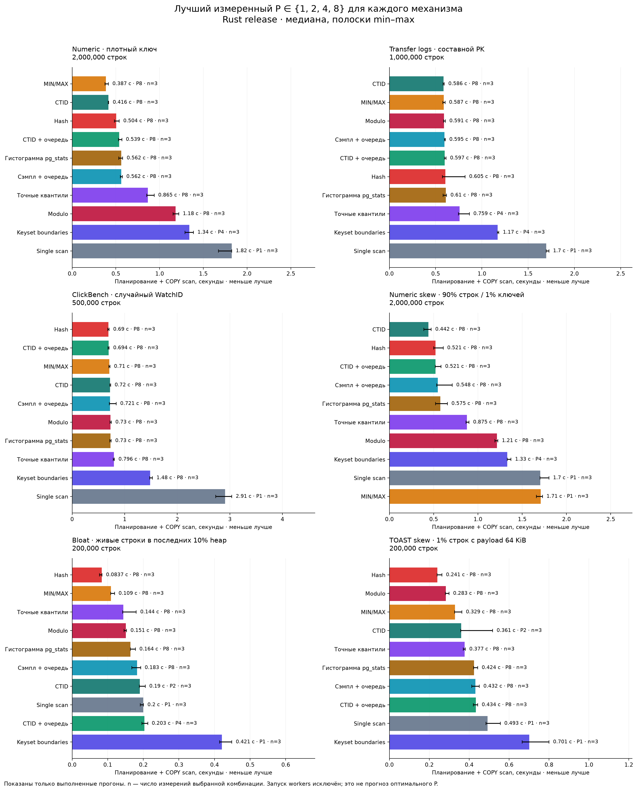

# Как распараллеливать snapshot PostgreSQL

Эксперимент 20 сентября 2026 года. Только snapshot, без CDC. Все итоговые
измерения выполнены отдельным **Rust RELEASE**-клиентом, читающим настоящий
`COPY (SELECT * ...) TO STDOUT (FORMAT BINARY)` по TLS. Генератор и PostgreSQL
sink Transferia использованы для создания исходных данных.

**Главный вывод: нужен выбор стратегии, а не один способ для всех таблиц.**
На равномерных данных CTID и индексные диапазоны близки. Перекос значений ухудшает баланс
MIN/MAX; перекос живых строк или TOAST — баланс равных физических диапазонов.
Hash иногда выигрывает по wall time, несмотря на лишние проходы по heap.

Основная матрица: **666 измерений**, 10 способов, 6 наборов, 1/2/4/8 readers,
по 3 повтора. Все timed COPY вернули ожидаемое число строк.

| Набор | Один COPY, с | Лучший наблюдаемый вариант | Планирование + чтение, с | Ускорение |
|---|---:|---|---:|---:|
| Numeric | 1,824 | Equal, 8 readers | 0,387 | 4,71× |
| Transfer logs | 1,695 | CTID, 8 | 0,586 | 2,89× |
| ClickBench | 2,912 | Hash, 8 | 0,690 | 4,22× |
| Key skew | 1,704 | CTID, 8 | 0,442 | 3,85× |
| Bloat | 0,200 | Hash, 8 | 0,084 | 2,39× |
| TOAST skew | 0,493 | Hash, 8 | 0,241 | 2,04× |

Это медианы, а не гарантия победы при малой разнице. Например, Transfer logs:
CTID 0,586 против Equal 0,587 с; ClickBench: Hash 0,690 против CTID queue 0,694 с.
Разброс повторов перекрывается. Эти варианты следует считать практически близкими.

**Открытие соединений меняет решение.** Если добавить создание readers и импорт
snapshot, лучшие P в основной матрице снижаются до 4 на первых четырёх наборах
и до 2 на Bloat/TOAST. Выигрыш Bloat тогда всего **1,03×**, практически отсутствует;
TOAST — **1,28×**. На Numeric лучший результат с соединениями — CTID/P4,
0,729 против 1,923 с у одного reader, **2,64×**. Это ещё не полное время доставки:
discovery, проверочный COUNT, создание destination и запись результата не включены.

Конкретные выводы:

- **Не делить только по MIN/MAX без оценки распределения.** Key skew: Equal/P8
  1,856 с против одного COPY 1,704 с. CTID/P8 — 0,442 с.
- **Равные страницы не гарантируют баланс.** В Bloat все 200 тыс. живых строк
  находятся в последней восьмой heap. Лучший CTID — 0,190 с, CTID queue — 0,203 с:
  распараллеливание почти не помогает.
- **Равные строки тоже не гарантируют баланс.** В TOAST skew последняя восьмая
  содержит около 87% объёма row datum. Hash/P8 — 0,241 с, CTID queue/P8 — 0,434 с.
  Здесь повторно читать маленький heap оказалось выгоднее, чем оставить один
  reader разбирать почти все большие payload.
- **Очередь не бесплатна.** На равномерном Numeric CTID/P8 — 0,416 с, очередь
  из 64 CTID chunks — 0,539 с. Дополнительные SQL-запросы и round trips видны.
- **Цена границ входит в результат.** Numeric: exact quantiles/P8 — 0,865 с,
  из них около 0,480 с планирование. Предварительный keyset в лучшем P4 — 1,340 с,
  из них около 0,666 с планирование.

[Все медианы, min/max и повторы — в архиве](research/pg-snapshot-benchmark-2026-09-20/reproduction.zip),
[масштабирование 1–8 readers](research/pg-snapshot-benchmark-2026-09-20/results/rust-scaling.png).

Дополнительная серия из **270 измерений** сравнила CTID, очередь, статистику,
hash и взвешенные CTID-границы при 8/16/32 readers. На обычных данных насыщение
наступало около 8–16: Numeric CTID/P16 0,395 с, P32 0,401 с. Hash при 32 часто
замедлялся: Transfer logs P16 0,582 → P32 0,898 с; Bloat P8 0,083 → P32 0,149 с.
Поэтому фиксировать максимальную параллельность для всех таблиц не стоит.
[Отдельные результаты серии — в архиве](research/pg-snapshot-benchmark-2026-09-20/reproduction.zip).

Проверена и новая идея: sampled rows взвешиваются по `pg_column_size(t.*)`,
после чего границы выбираются по накопленному объёму в порядке CTID.
Она лучше равных страниц при TOAST skew, но стоимость планирования существенна:
наивный вариант/P8 — 0,308 с против 0,415 с у CTID queue и 0,246 с у hash.
Это не «бесплатный 1% sample»: BERNOULLI проходит весь heap, а row datum size
лишь приближает объём COPY. На обычных данных дополнительное планирование
не окупилось.

Ещё **108 измерений** проверили два варианта: `hash(CTID)`, которому не нужен
разбор типа ключа, и линейный выбор взвешенных границ после сортировки sample.
Проверка на PostgreSQL подтвердила одинаковые массивы границ старой и новой
реализаций при P8/P16; планирование TOAST снизилось примерно до 20 мс.
В этой отдельной серии:

| Набор | CTID | Hash ключа | Hash(CTID) | Линейные weighted CTID |
|---|---:|---:|---:|---:|
| Key skew, лучший P4/8/16 | 0,388 с / P8 | 0,643 / P16 | 0,495 / P16 | 0,528 / P16 |
| Bloat, лучший P4/8/16 | 0,132 / P16 | 0,095 / P8 | 0,083 / P16 | 0,187 / P16 |
| TOAST skew, лучший P4/8/16 | 0,328 / P8 | 0,245 / P8 | 0,233 / P16 | 0,271 / P16 |

На TOAST при одинаковом P8 линейный weighted вариант улучшил CTID:
**0,281 против 0,328 с**, но Hash ключа всё ещё быстрее: **0,245 с**.
Разница Hash и Hash(CTID) на TOAST неубедительна: интервалы повторов перекрываются.

Главная польза Hash(CTID) — независимость predicate от PK, NULL и collation.
Это распределение работы, а не замена идентичности строки хешем. Цена остаётся
той же: каждый reader просматривает heap. В Bloat weighted вариант выравнивает
байты, но оставляет одному chunk большой пустой префикс. Значит, **для хорошего
планировщика нужны одновременно страницы, строки и байты**, а не один из них.

[Отдельные результаты уточнённой серии — в архиве](research/pg-snapshot-benchmark-2026-09-20/reproduction.zip),
[совпадение границ — в архиве](research/pg-snapshot-benchmark-2026-09-20/reproduction.zip).

Диагностика **40 EXPLAIN ANALYZE plans** подтверждает цену методов: на Numeric
один CTID chunk обращается примерно к 2,6 тыс. heap buffers, один hash reader —
ко всем 20,6 тыс. Все диагностические чтения попали в shared buffers; это не
доказательство аналогичного результата на холодном SSD. Время EXPLAIN SELECT
не заменяет COPY throughput, особенно при TOAST.
[Планы и объяснение нагрузки — в архиве](research/pg-snapshot-benchmark-2026-09-20/reproduction.zip).

## Что именно проверено

PostgreSQL 17.11: 32 vCPU, 128 GiB RAM, local SSD; `shared_buffers=8 GiB`.
`default_statistics_target=1000`; маршрут через pooler, порт 6432.
Клиент: Linux, 32 vCPU AMD EPYC 7713, 47 GiB RAM, Rust 1.97.1,
16 потоков Tokio. Все readers работают на одном master и импортируют один
REPEATABLE READ snapshot. Внутренний parallel query PostgreSQL и JIT выключены,
чтобы число клиентских readers имело однозначный смысл.

| Набор | Строк | Особенность |
|---|---:|---|
| Numeric | 2 000 000 | Реальный генератор: 8 numeric-столбцов, плотный возрастающий PK |
| Transfer logs | 1 000 000 | Реальный генератор: 26 столбцов, составной PK из 4 полей, nullable payload |
| ClickBench | 500 000 | Реальный генератор: 105 столбцов, составной PK из 5 полей, ключ не коррелирует с физическим порядком |
| Key skew | 2 000 000 | Производный Numeric: 90% строк в первом 1% числового диапазона |
| Bloat | 200 000 | Производный Numeric: удалены первые 90% строк, live rows остались в конце heap; обычный VACUUM, без FULL |
| TOAST skew | 200 000 | Производный Numeric: 99% строк имеют payload 32 B, последние 1% — 64 KiB; EXTERNAL storage |

У Transfer logs создан дополнительный индекс на `_system_offset`; у ClickBench
`WatchID` — первый компонент существующего PK. В измеренных наборах эти поля
уникальны и не содержат NULL, что проверено отдельно. **Это не бенчмарк всех
возможных типов ключа:** сложные типы и NULL проходят отдельные функциональные
проверки с точным сравнением множества строк.

Весь набор помещается в RAM сервера. Это эксперимент преимущественно с прогретым
кэшем; cold-cache, ограничение SSD и многотерабайтные таблицы не измерялись.

## Сравниваемые способы

| Способ | Как формируются части | Главная потенциальная цена |
|---|---|---|
| Один COPY | Полная таблица, один reader | Один поток чтения/сериализации/клиентской обработки |
| Equal ranges | MIN/MAX и равные числовые интервалы, P частей | Перекос распределения значений |
| Exact quantiles | Полные `percentile_disc`, P частей | Предварительное чтение и сортировка |
| Sample ranges | Квантили `TABLESAMPLE SYSTEM(1)`, 8P частей | Ошибка выборки, дополнительные запросы |
| Statistics ranges | Границы из `pg_stats.histogram_bounds`, до 8P частей | Устаревание, MCV, отсутствие статистики |
| Modulo | Нормализованный остаток ключа по P | Обычно P полных проходов с фильтрацией |
| Hash | PostgreSQL hash ключа, затем остаток по P | Обычно P полных проходов, вычисление hash |
| CTID ranges | P диапазонов физических heap-страниц | Неравная плотность/ширина живых строк |
| CTID queue | Та же механика, очередь из примерно 8P частей | Больше SQL-запросов и round trips |
| Keyset boundaries | Последовательный поиск всех границ по индексу, затем 8P частей | Предварительный проход по индексу и запрос на границу |

Keyset здесь — предварительное планирование, **не** online/adaptive keyset.
Количество частей различается намеренно: сравниваются готовые стратегии,
а не только качество поиска границ при фиксированном числе SQL-запросов.

Основная метрика — **планирование + полное чтение**. Открытие соединений
показано отдельно и также включено в дополнительную метрику запуска с новыми readers.
Три повтора на комбинацию, порядок перемешан фиксированным seed.
Точные COUNT/DISTINCT для проверки набора, EXPLAIN и запись отчётов находятся
вне измеряемого интервала. Такой COUNT не предлагается выполнять перед каждым
production snapshot.

Клиент проверяет бинарное обрамление COPY и считает строки, пропуская payload
без декодирования в Arrow. Здесь нет записи в destination, sink backpressure и
durability: цифры характеризуют путь чтения PostgreSQL, а не полный Transferia
pipeline. [Подробная методология — в архиве](research/pg-snapshot-benchmark-2026-09-20/reproduction.zip).

## Корректность, типы и статистика

**34 из 34 функциональных сценариев прошли.** Для них сравнивались точные
идентичности строк/наборы результатов; совпадение одного COUNT не считалось
достаточным. Это проверки SQL-семантики, а не Python-замеры производительности.

| Группа | Проверено и что это меняет |
|---|---|
| Ключи и типы | Составные и смешанные PK; UUID, bytea, текст/collation, точный дробный numeric, BIGINT MIN/MAX, даты BC/±infinity, timestamptz/DST/микросекунды, float NaN/±infinity/±0, enum и arrays с NULL-элементами/разными нижними границами. Порядок должен оставаться серверным. |
| NULL и повторы | Неуникальный split field, все значения NULL, несколько NULL-patterns составного cursor. Нужны явное покрытие NULL и уникальный tie-breaker. Сам PostgreSQL PK не содержит NULL. |
| Статистика | Отсутствие ANALYZE, target=0, stale histogram, 90% MCV, одинаковые cuts, пустой sample. Старые histogram extrema покрыли только 900 из 1500 строк; открытые хвосты вернули все 1500. |
| Длинный ключ и RLS | У текстовых ключей около 1,5 KiB histogram отсутствовала; при FORCE RLS статистика скрыта, но CTID и ключевые диапазоны вернули ровно разрешённые 50 из 100 строк. |
| Физическое разбиение | Пустые/маленькие heaps, stale `relpages=0` при непустой таблице, границы вне heap, native TID predicate вместо извлечения блока из текста, одинаковые CTID в разных leaves. |
| MVCC и retry | Движение PK и CTID при UPDATE; общий snapshot сохраняет набор. Разные snapshots дали потерю и дубль даже при неизменном COUNT. Истечение exporter и повторный export живого importer проверены. |
| Partition topology | На parent с двумя leaves: SHARE UPDATE EXCLUSIVE на parent + ACCESS SHARE на leaves до export. INSERT прошёл; snapshot остался на 20 строках при 21 у свежего reader. ATTACH и ANALYZE блокировались. |

Для последнего режима нужны соответствующие привилегии; одного SELECT
недостаточно для SHARE UPDATE EXCLUSIVE. Блокировка также мешает обслуживанию
parent. Сам `DETACH CONCURRENTLY` не исполнялся: проверен конфликт требуемого ему
режима блокировки. Многоуровневые partitions, mixed ASC/DESC, custom opclasses и
nondeterministic collations не получили полного экспериментального покрытия.
Поддержку этих случаев нужно проверять отдельно, выбирая безопасный
одиночный запрос или другой подтверждённый путь, если нужный контракт неизвестен.

[Сценарии, наблюдения и ограничения — в архиве](research/pg-snapshot-benchmark-2026-09-20/reproduction.zip),
[полный JSON результатов — в архиве](research/pg-snapshot-benchmark-2026-09-20/reproduction.zip).

Статистику нельзя использовать для определения полноты чтения. Безопасные
диапазоны имеют открытые наружные хвосты, непересекающиеся полуоткрытые внутренние
границы и отдельное покрытие NULL. Ошибка статистики тогда ухудшает баланс,
но не теряет данные. `n_distinct=-1` не является доказательством UNIQUE.

В PostgreSQL гистограмма исключает MCV. Длинные varlena-значения больше 1024 B
обычный анализатор исключает из сравнения значений для MCV/histogram; RLS может
скрыть `pg_stats`; extended statistics не дают готовых составных квантилей.
Составные границы, NaN, даты, bytea и строки должны сравниваться **сервером в
исходном типе и collation**, а не после сортировки строкового представления
на клиенте. [Аудит статистики с первичными источниками — в архиве](research/pg-snapshot-benchmark-2026-09-20/reproduction.zip).

## Предлагаемый планировщик

Я бы реализовывал **адаптивный выбор из нескольких простых путей**, с CTID как
основным кандидатом для полного ordinary-heap snapshot. Универсальное превосходство
одного алгоритма эксперименты опровергают; превосходство этого адаптивного
планировщика в целом ещё нужно подтвердить отдельным production-бенчмарком.

| Условие | Какой путь выбирать первым |
|---|---|
| Маленькая таблица; время открытия readers сравнимо с чтением | Один COPY или параллельная обработка разных таблиц вместо дробления каждой маленькой |
| Полный heap snapshot, обычная плотность и ширина строк | Native CTID ranges; сначала мало достаточно крупных частей, увеличивать очередь при наблюдаемом дисбалансе |
| Хороший индекс, равномерный ключ и высокая корреляция с heap | Индексные диапазоны; MIN/MAX только после проверки распределения |
| Составной/строковый ключ, перекос или плохая histogram | CTID либо серверные typed ranges по полному уникальному cursor; histogram/sample — лишь hint, MCV и NULL учитываются отдельно |
| Маленький или прогретый heap, сильный перекос live rows/TOAST, есть бюджет CPU источника | Проверять Hash(CTID) или Hash ключа; измеренный выигрыш сопоставлять с увеличением source work |
| Дорогой cold heap, селективный фильтр, возможен index-only scan | Отдельно оценивать индексный путь; не включать P полных hash-сканов автоматически. Эти режимы здесь не бенчмаркались |
| Нестандартный AM/view/query или неизвестный контракт | Один корректный запрос либо подтверждённый специальный план; не имитировать CTID range scan текстовым фильтром |

Улучшенный scheduler должен оценивать стоимость ещё не выданной части примерно
как `a × heap_pages + b × live_rows + c × output_bytes + query_overhead`.
Коэффициенты зависят от стенда и уточняются по реальным частям; `pg_stats` даёт
стартовую оценку, а не истину. Это **предлагаемая модель**, не уже измеренная
production-реализация. Измеренный bytes-only weighted вариант показывает,
почему член `heap_pages` нельзя выбрасывать.

Ограниченный пилот и последующее изменение размеров нужны только там, где
ожидаемая экономия покрывает их стоимость. Не начинать каждый snapshot с полного
COUNT, ANALYZE, точных квантилей или BERNOULLI-прохода. Выбор P должен учитывать
создание соединений, доступный пул, source CPU, сеть и downstream backpressure.
Для нашего стенда 8–16 readers насыщают длинное чтение; для коротких переносов
новые соединения часто делают P2/P4 выгоднее.

Перспективный дополнительный вариант — **hash-подразбиение только тяжёлого
CTID-диапазона**: повторно просматривается его небольшой heap-участок, а большие
payload распределяются между readers. Полный алгоритм переключения на такой
режим ещё не реализован и не измерен; нельзя менять уже частично завершённый
диапазон без протокола, исключающего повторную выдачу строк.

Обязательная общая основа:

1. Зафиксировать разрешённое множество relations, проекцию и семантику.
   Для ordinary heap: BEGIN, ACCESS SHARE lock, export snapshot, получение
   размера main fork. Каждый reader импортирует тот же snapshot до первого SELECT.
   Через transaction pooler настройки задаются внутри транзакции, имена таблиц
   квалифицируются схемой. Failover на другой host не продолжает старый snapshot.
2. Сначала выбрать применимый путь. CTID относится к физическому leaf и table AM;
   его нельзя автоматически подставлять в произвольный JOIN/view/foreign table.
   Селективный WHERE и index-only projection требуют отдельного сравнения.
3. Статистика и sampling задают только предполагаемый баланс. Пустая выборка,
   отсутствующая histogram, NULL и большие MCV не означают пустую таблицу.
   При неуникальном split field нужен PK tie-breaker; для большого NULL bucket
   нужен свой PK/CTID-план, иначе он останется одним тяжёлым task.
4. Измерять фактические bytes/time и нагрузку источника. Размеры будущих частей
   и число readers подстраивать в пределах явной конфигурации. Уже выданные
   интервалы не менять; дробление ещё не выданного диапазона должно атомарно
   заменять родителя непересекающимися детьми с тем же полным покрытием.
5. Task завершён только после durable acknowledgement destination. При retry
   нужны те же snapshot и идентичность task, а также известная семантика повторной
   записи. CTID не является переносимым checkpoint между snapshots.
6. Сохранять живую keeper-транзакцию. Потеря исходного exporter уничтожает
   возможность новых импортов старого ID, но живой importer может повторно
   экспортировать тот же snapshot под новым ID. Если живых holders не осталось,
   нужен новый epoch; незаметно продолжать старую копию новым snapshot нельзя.

Для partition topology одного ACCESS SHARE недостаточно. Проверенный на двух
leaves режим с SHARE UPDATE EXCLUSIVE описан выше; для произвольной иерархии
нужно отдельно доказать порядок discovery и захвата всех нужных locks.
Keeper должен сохранять **и snapshot, и необходимые блокировки**. Повторный
export не восстанавливает locks умершего coordinator. Одинаковые ACCESS SHARE
можно заранее держать у резервного keeper; SHARE UPDATE EXCLUSIVE конфликтует
сам с собой, поэтому для topology нужен отдельный долгоживущий guardian либо
явный restart при потере его гарантий.
[Разбор механизмов PostgreSQL — в архиве](research/pg-snapshot-benchmark-2026-09-20/reproduction.zip),
[условия применимости и retry — в архиве](research/pg-snapshot-benchmark-2026-09-20/reproduction.zip).

## Артефакты и воспроизведение

Все исходные замеры, CSV/JSON, подробные разборы, конфигурации и Rust-измеритель
собраны в [один архив](research/pg-snapshot-benchmark-2026-09-20/reproduction.zip).
Распакуйте его в отдельный каталог: внутри сохранены структура проекта и
исходная версия этого отчёта со ссылками на каждый материал. Архив также
содержит исторические служебные заметки и необязательный SQL уборки; для
воспроизведения следуйте `PROVENANCE.md` и `fixtures/README.md`.

- [Rust RELEASE harness — в архиве](research/pg-snapshot-benchmark-2026-09-20/reproduction.zip),
  [исходник — в архиве](research/pg-snapshot-benchmark-2026-09-20/reproduction.zip), Cargo.lock и тесты парсера.
- [Профили генератора и подготовка шести таблиц — в архиве](research/pg-snapshot-benchmark-2026-09-20/reproduction.zip).
- [Происхождение результатов, версии измерителя и повторный анализ — в архиве](research/pg-snapshot-benchmark-2026-09-20/reproduction.zip).
- [Сводные CSV/JSON и графики — в архиве](research/pg-snapshot-benchmark-2026-09-20/reproduction.zip).
- [Функциональные corner cases — в архиве](research/pg-snapshot-benchmark-2026-09-20/reproduction.zip).
- [Исходный обзор механизмов конкурентов](table-splitting-research-2026-09-20.md).

Проверка: **1 044 сравнительных Rust RELEASE запуска** (666 + 270 + 108),
20 отдельных диагностических COPY и 40 EXPLAIN plans, **34/34** функциональных
сценариев, **6/6** release-тестов парсера/границ. Все сравниваемые runs завершены,
проверили число строк и сохранены; smoke/diagnostics не смешаны с тремя основными
cohorts. Прототипный crate собран в release на машине измерений.

Это исследование и работающий измеритель. Production-интеграция адаптивного
планировщика, полный sink commit/replay, большие cold-cache таблицы и все
нестандартные PostgreSQL-типы/DDL не объявляются реализованными или проверенными.
